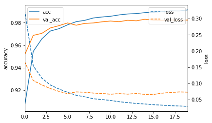

# Training a Multilayer Perceptron on the MNIST dataset

Problem: Using Keras and a dedicated GPU cluster, training a CNN with Multilayer Perceptron on the MNIST dataset.

Approach:  Vanilla model and a model with drop-outs are compared. Learning curves are visualized.

## Data 
- Data is imported from keras' built in package (keras.datasets import mnist)

## Files
- main.py includes all the codes for cleaning the data and models.

## Learning Curves (Visualization):
- Without Drop-out:

- With Drop-out:

- Bla bla bla

  

